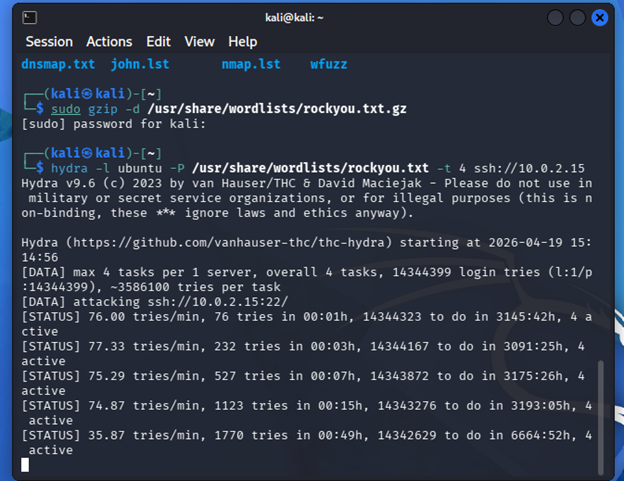
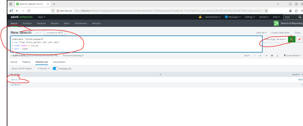
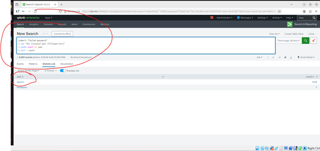
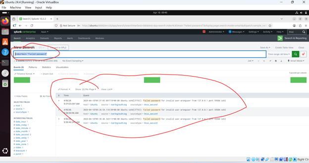
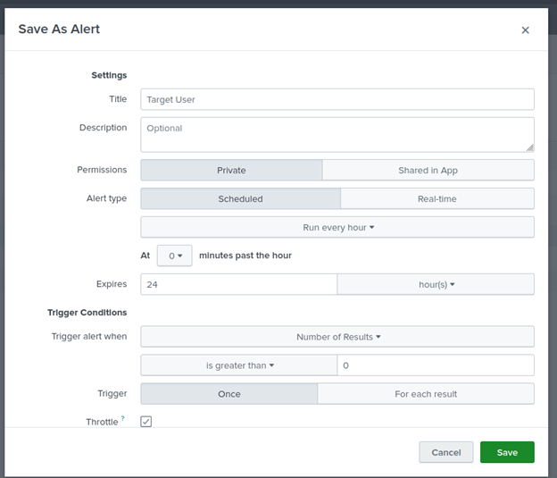
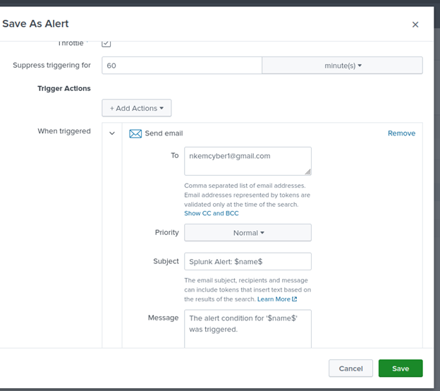

# SOC-Analyst-Lab-SSH-Brute-Force-Detection
Simulation and detection of an SSH brute-force attack using Splunk, with log analysis and alerting in a SOC lab environment
# 🔐 SSH Brute-Force Attack Detection using Splunk

## 📌 Project Overview
This project demonstrates the simulation and detection of an SSH brute-force attack using Kali Linux and Splunk in a virtual lab environment.

## 🛠️ Tools & Technologies
- Splunk (SIEM)
- Kali Linux (Attacker)
- Ubuntu (Target System)
- Hydra (Brute-force tool)

## 🧱 Lab Setup
- Ubuntu VM configured with SSH enabled
- Splunk installed on Ubuntu monitoring `/var/log/auth.log`
- Kali Linux used to simulate attack

## ⚔️ Attack Simulation
A brute-force attack was executed using Hydra:
hydra -l ubuntu -P /usr/share/wordlists/rockyou.txt ssh://<target-ip>

## 🔍 Detection in Splunk
SPL queries used:
index=main "Failed password"
index=main "Failed password"
| stats count by src_ip
| sort -count

## 📊 Findings
- Multiple failed login attempts detected
- Single IP responsible for repeated login failures
- Pattern consistent with brute-force attack

## 🚨 Alerting
An alert was configured in Splunk to trigger when failed login attempts exceed a threshold.

## 🧠 Skills Demonstrated
- Security monitoring
- Log analysis
- Incident detection
- SIEM usage (Splunk)
- Basic threat hunting

## 📷 Screenshots
- Hydra attack
  

- Attacking IP
  
 

 - Target User

- Failed Login
  
 

 - Alert Creation

- Alert CreationCont
  

- Alert Creation Saved
  

## 📌 Conclusion
This project demonstrates how brute-force attacks can be detected using log analysis and SIEM tools, highlighting the importance of proactive monitoring in cybersecurity operations.
